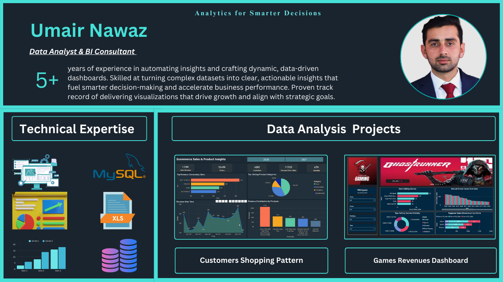

# Muhammad Umair Nawaz
### Data Analyst & BI Consultant
I am a Data Analyst and BI Consultant with hands-on experience in SQL, Power BI, and Excel.  
I specialize in transforming complex datasets into clear, actionable insights for business and operations teams.  
My work focuses on data cleaning, modeling, dashboarding, and decision-oriented storytelling.

## Professional Expertise

### End-to-End Data Analytics & Automation
- Automated data pipelines from **Excel / CSV → SQL → Power BI**
- Designed structured datasets and reusable data models for reporting
- Eliminated manual reporting through scheduled refresh and automation

### Business Intelligence & Dashboards
- Built executive and operational dashboards in **Power BI** and **Tableau**
- Designed KPIs for performance tracking and decision support
- Delivered clean, business-focused visuals for stakeholders

### Tools & Technologies
- **SQL:** Data modeling, CTEs, Window Functions, performance optimization  
- **Power BI:** DAX, data modeling, KPI & management dashboards  
- **Excel:** Advanced formulas, pivot tables, scenario & trend analysis  
- **Tableau:** Interactive dashboards and visual analytics  
- **IBM SPSS:** Statistical analysis and structured data exploration  
- **Data Warehousing:** Star schema, fact & dimension modeling
